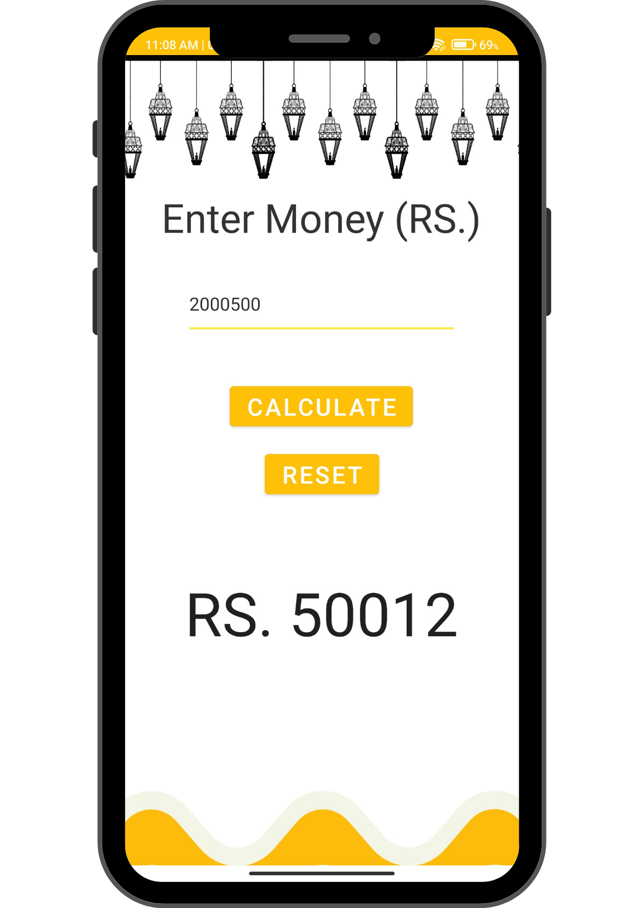

<h2>Islamic Mobile App</h2>
This app is made to calculate Zawkat and Fitrana
Just add your amount and Calculate Zawkat and add add the count of your family and select the method of paying fitrana.
<h3>Working Image</h3>

